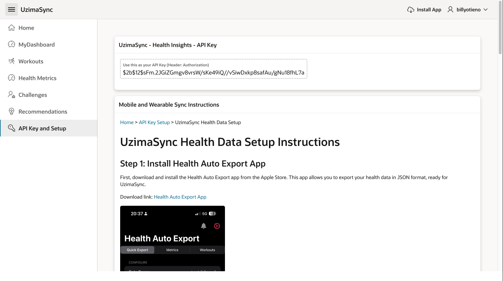
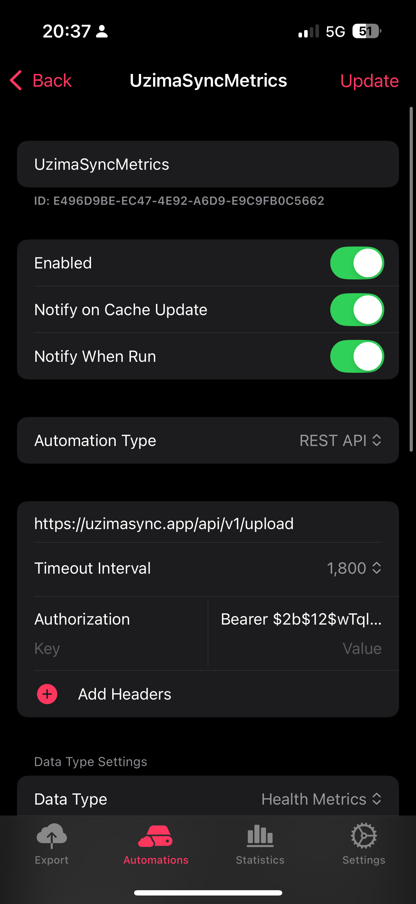
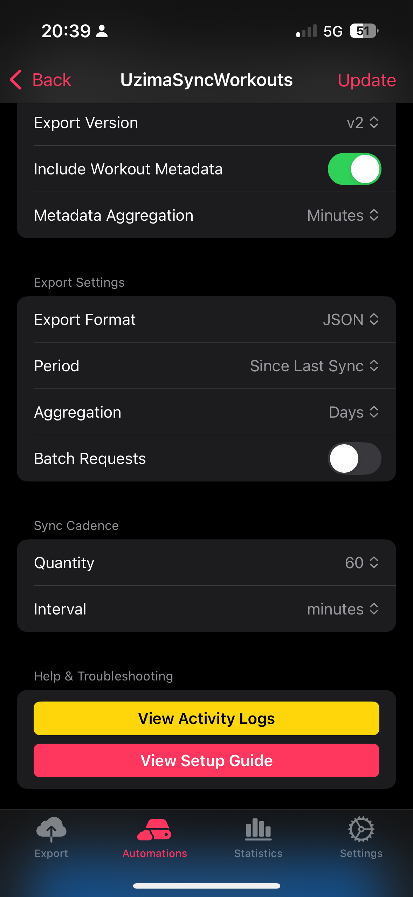
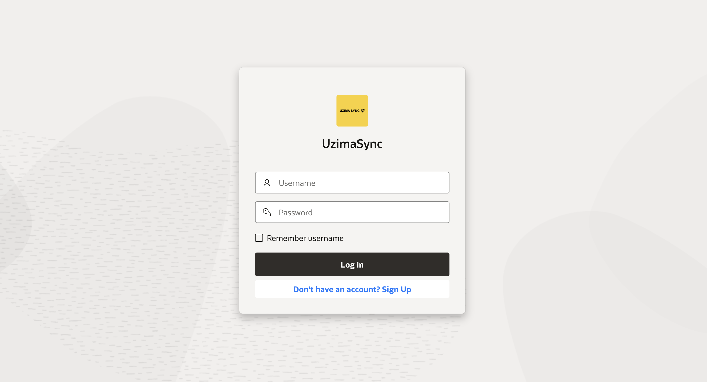
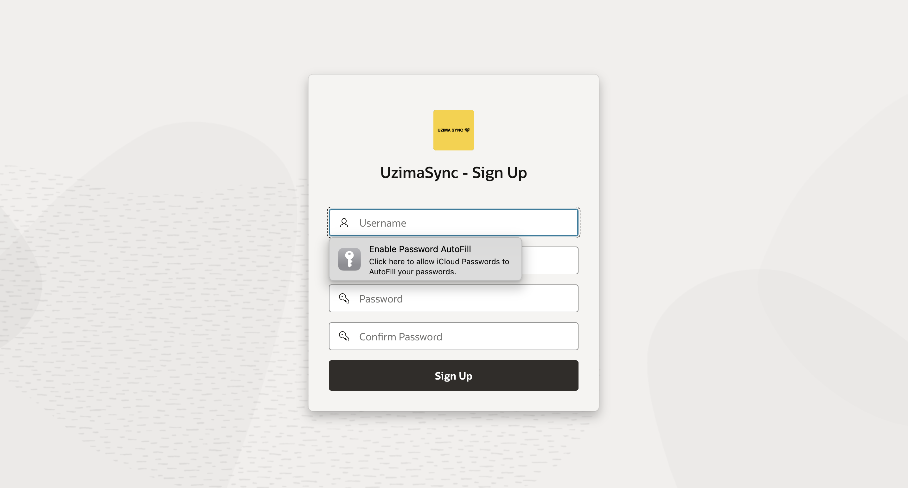

# UzimaSync
UzimaSync is a health data management platform that synchronizes health metrics from wearable devices into a centralized database, providing real-time analytics, personalized health insights, and gamification for enhanced user engagement. Built on a robust tech stack, UzimaSync leverages Oracle’s advanced tools and frameworks to create a seamless and secure experience for health and wellness data management.

## Technology Stack

- **Oracle APEX**: Provides the user interface and interactive analytics dashboard, enabling users to track health metrics, view personalized insights, and engage with gamified wellness challenges.
  
- **Flask API**: Serves as the backend API layer, facilitating communication between wearable devices and the Oracle Autonomous Database. It handles data ingestion and secure transmission of health metrics.

- **Oracle Autonomous Database**: Acts as the central repository for storing and managing health data. It offers scalability, security, and automated maintenance, ensuring reliable storage and processing of large health data sets.

- **Oracle Object Storage**: Used to store large files and raw data from wearable devices. This storage solution is optimized for scalability and high availability, allowing UzimaSync to manage data from multiple wearables seamlessly.

- **Oracle Generative AI**: Powers the personalized wellness insights feature by generating tailored recommendations for users based on their health data, helping them achieve individual wellness goals.

## Key Features

### Real-Time Health Monitoring
Utilizes the Flask API to capture health data from wearable devices in real time, providing instant analytics and insights through Oracle APEX dashboards.

### Centralized Data Management
All user data is securely stored in the Oracle Autonomous Database, ensuring consistent access and high data integrity. The database structure is optimized for analytics, allowing for efficient query performance and data retrieval.

### Gamified Wellness Challenges
Integrates gamification into the platform using SQL/PLSQL-based challenges within Oracle APEX, encouraging user engagement by tracking achievements and rewarding progress.

### Scalable Data Storage
Oracle Object Storage supports the storage of large volumes of health-related data, ensuring that the platform can scale as the user base grows and data volume increases.

### AI-Powered Insights
Oracle’s Generative AI is used to analyze health metrics and provide personalized recommendations, driving user engagement by making wellness programs relevant to each individual.

## API Overview

The Flask API enables the ingestion of data from wearables into the Oracle Autonomous Database and supports endpoints for retrieving user-specific metrics. Each user is provided with an API key upon registration, ensuring secure access to the API.

### Example API Endpoints
- `POST /api/v1/upload` - Ingests health data from a wearable device.
- `POST /api/v1/login` - Support user authentication.
- `POST /api/v1/register` - Facilitates user registration and API Key Generation.

## Deployment

UzimaSync leverages Oracle Cloud for deployment, ensuring reliability, security, and scalability:
- **Backend**: The Flask API is deployed using Gunicorn for robust performance.
- **Frontend**: Oracle APEX provides a mobile-friendly UI with responsive design for tracking health metrics.
- **Database**: Oracle Autonomous Database hosts and manages health data, offering auto-scaling and automated maintenance for high availability.

## Security and Compliance

- **Data Encryption**: All data stored in Oracle Autonomous Database and Oracle Object Storage is encrypted at rest.
- **API Security**: User-specific API keys control access, ensuring that only authorized devices can submit or retrieve data.
- **Compliance**: UzimaSync adheres to industry-standard data protection practices to secure personal health information.


## Architecture
UzimaSync uses a microservice architecture with Oracle APEX, Flask API, and SQL/PLSQL:
- **UzimaSync API - A Flask API**: Handles user authentication, file uploads, and data processing.
- **Oracle APEX**: Provides a secure interface for data visualization, insights, and user interaction.
- **Autonomous Database**: Centralizes all user health data, enabling analysis and reporting.

## Getting Started

### Prerequisites
- **Python** (3.8+)
- **Oracle Database**
- **Oracle APEX**

### Installation

1. **Clone the Repository**
   ```bash
   git clone https://github.com/yourusername/UzimaSync.git
   cd UzimaSync
   ```

2. **Set Up the Flask Environment**  
  Install dependencies:
     ```bash
     pip install -r requirements.txt
     ```
   Start the Flask API:
     ```bash 
     flask run
     ```

3. **Deploy Oracle APEX Application**
   - Import the APEX application to your Oracle APEX instance.
   - Configure environment variables for database connection.

### Usage

#### Setting up HealthAutoExport
1. **Once you Register and Login go to API Key & Setup Page**
   - Copy the API Key and save it in a secure location.
  
  

2. **Set up HealthAutoExport**
   - Download the HealthAutoExport app on your device. Link [Download HealthAutoExport App](https://apps.apple.com/us/app/health-auto-export-json-csv/id1115567069)
   - Enter the API URL, API Key in the app auto-sync to start syncing health data.
    - **API URL**: `http://uzimasync.app/api/v1/upload`
    - **API Key**: `Your API Key`

3. **Setup Metrics & Workouts**
  
  - Setup Metrics Automations
    - Select the metrics you want to sync and set up the sync frequency.
   

- Setup Workouts Automations
   - Select the workouts you want to sync and set up the sync frequency.
   

- **Sync Health Data**
  - Once you have set up the metrics, the app will automatically sync health data to the Flask API.
  - The Flask API will ingest the data into the Oracle Autonomous Database.

#### Dashboard Access
Log into the Oracle APEX dashboard to view personalized metrics, challenges, and health data.

[Login to UzimaSync](https://g1addbbc700f30e-boadw.adb.me-jeddah-1.oraclecloudapps.com/ords/r/uzimasync_wp/uzimasync/login)  
[Register to UzimaSync](https://g1addbbc700f30e-boadw.adb.me-jeddah-1.oraclecloudapps.com/ords/r/uzimasync_wp/uzimasync/register)


```
# Sample Username & Password
Username: bonganibendile
Password: welcome1234_
```

#### Login Page


#### Sign-Up Page


### Contributing
Feel free to submit issues or pull requests to contribute to UzimaSync. For major changes, open an issue to discuss your approach.

### License
This project is licensed under the MIT License - see the [LICENSE](LICENSE) file for details.

---
